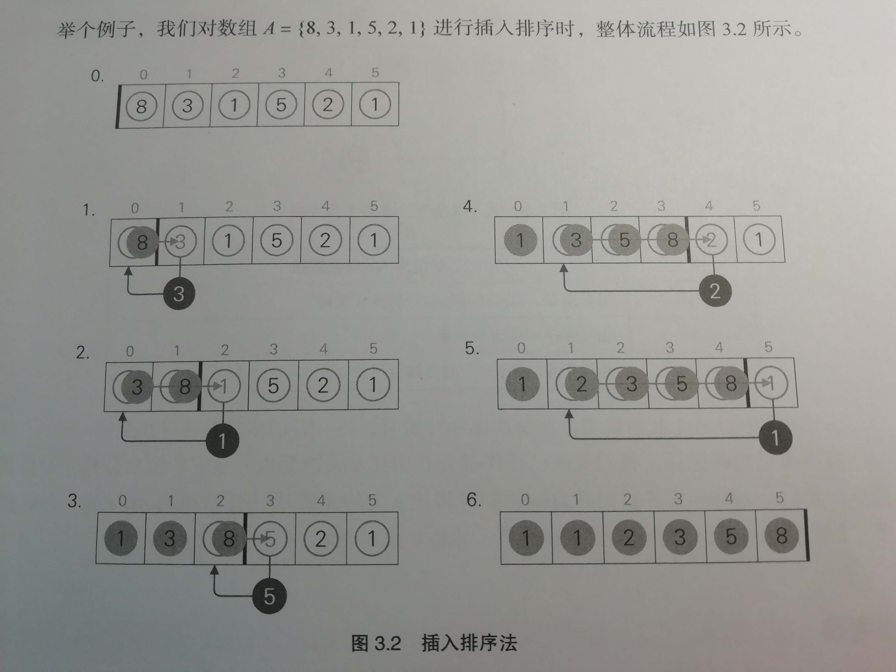
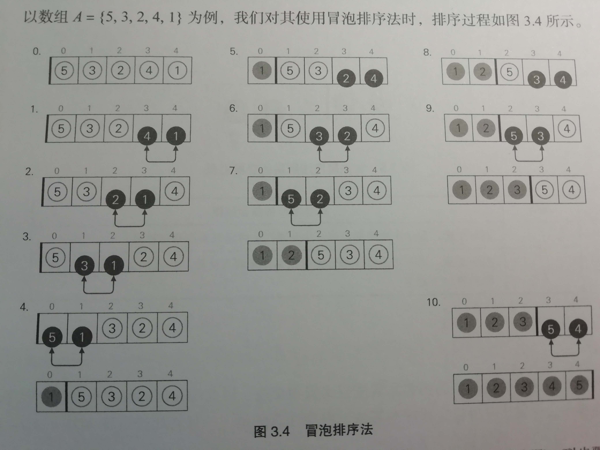
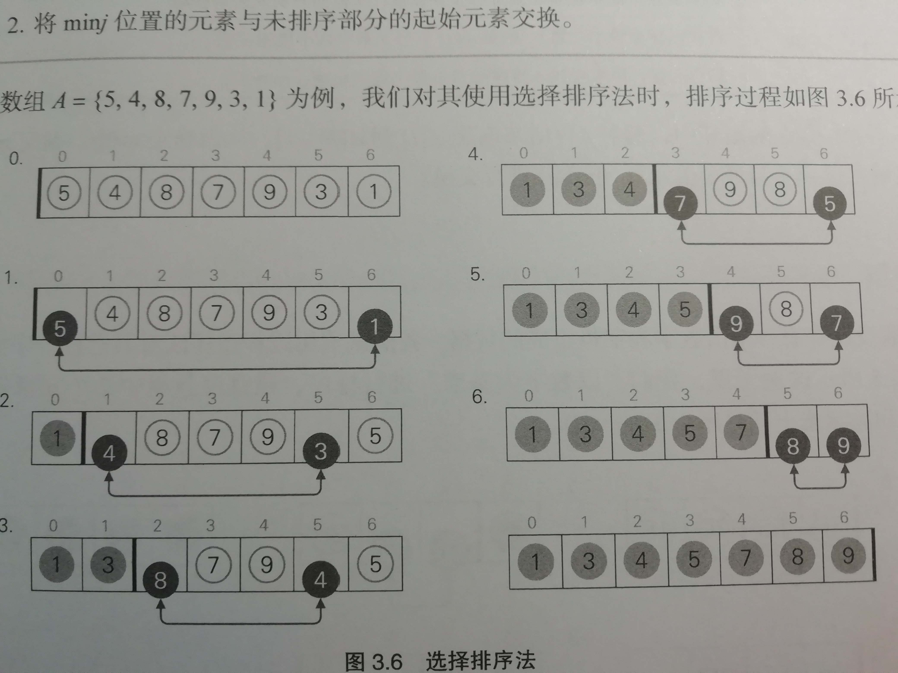
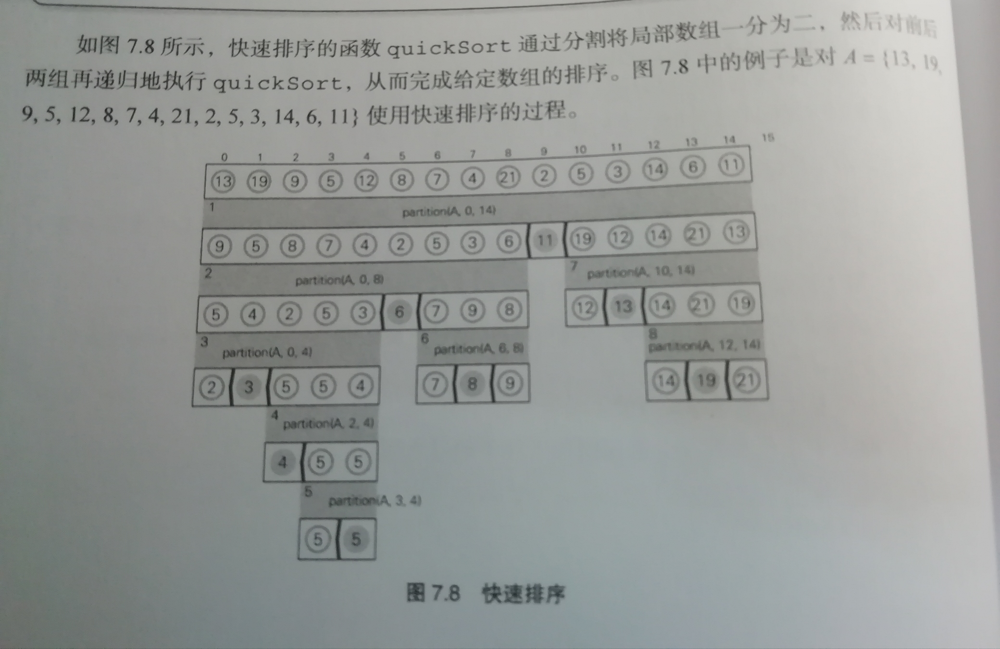

# 排序

## 目录

### 初等排序

1. <a href="#insert">插入排序</a>

2. <a href="#bubble">冒泡排序</a>

3. <a href="#selection">选择排序</a>

4. <a href="#shell">希尔排序（缩小增量排序）</a>

### 高等排序

1. <a href="#merge">归并排序</a>

2. <a href="#quick">快速排序（快排）</a>

3. 计数排序

4. 利用标准库排序

5. 最小成本排序

6. 

## 初等排序

### 1. 插入排序

1. 组成部分：**已排序部分** 和 **未排序部分**

2. 步骤（直到未排序部分消失）：
    * 取出**未排序部分**的开头元素赋给变量 *temp*
    * 在**已排序部分**，将所有比 *temp* 大的元素向后移动一个单位
    * 将取出的元素 *temp* 插入空位

3. 复杂度：O（N2）

4. 特点：
    * 稳定
    * 输入**顺序**能大幅影响它的复杂度
    * 能快速处理**相对有序**的数据

### 2. 冒泡排序

1. 组成部分： **已排序部分** 和 **未排序部分**

2. 步骤（直到数组中不含**顺序相反**的元素）：
    *从数组末尾（开头也可以）开始依次比较相邻的两个元素，如果**大小关系相反则交换位置**

3. 复杂度：O（N2）

4. 特点：
    * 稳定
    * 交换次数体现数据的**杂乱程度**

### 3. 选择排序

1. 组成部分： **已排序部分** 和 **未排序部分**

2. 步骤（重复执行 N - 1 次）：
    * 找出**未排序部分**最小值的位置 min*j*
    * 将 min*j* 位置的元素与**未排序部分**的**起始元素**交换

3. 复杂度：O（N2）

4. 特点：
    * **直接交换**两个元素 --> 不稳定

### 4. 希尔排序（插入排序的改进版）

1. 组成部分：**已排序部分** 和 **未排序部分**

2. 步骤：
    * 选择一个增量序列 t1, t2, ..., tk
    * 按照增量序列的个数 k ，对序列进行 k 趟排序
    * 每趟排序，对应增量 ti，将排序序列**分割**成长度为 m 的子序列，分别对各子序列进行**直接插入排序**，**增量因子为1**的时候，整个序列作为一个表来处理。

3. 复杂度：O（N1.3）

4. 特点：
    * 优先比较距离较远的元素
    * 第一个突破 O ( N2 ) 的排序算法
    * 可提前设定间隔序列，也可动态定义间隔序列

## 高等排序

### 1. 归并排序

1. 组成部分：子序列

2. 步骤（递归）：
    * 将给定的、含有 n 个元素的（局部）数组**分割**成两个局部数组，每组各包含 n/2 个元素
    * 对以下两个数组进行**归并排序**（**递归**）
    * 将已经排序完成的局部数组**整合**，变成一个数组

3. 复杂度：O（<i>n</i> log<i>n</i>）（平均）

4. 特点：
    * 稳定
    * 高效
    * 占用空间大
    * 分而治之，归并思想

### 2. 快速排序（快排）

1. 组成部分：子序列

2. 步骤：
    * 将对象（局部）数组**分割**成前后两个**局部数组**
    * 分别对前后部分的局部数组执行快排（**递归**）

3. 复杂度：O（<i>n</i> log<i>n</i>）（平均）

4. 特点：
    * 分而治之
    * 不稳定
    * 不会额外占用内存（原地排序/内部排序）
    * 某些顺序的数组会导致递归深度过深 --> 栈溢出

### 3. 计数排序

2. 步骤：
    * 找出待排序的数组中**最大和最小**的元素
    * 统计数组中每个值为i的元素出现的**次数**，存入数组 C 的第i项
    * 对所有的**计数累加**（从 C 中的第一个元素开始，每一项和前一项相加）
    * **反向填充**目标数组：将每个元素 i 放在新数组的第 C[i] 项，每放一个元素就将 C[i] 减去1

3. 复杂度：O（n+k）

4. 特点：
    * 稳定
    * 数据必须是有确定范围的整数
    * 速度快