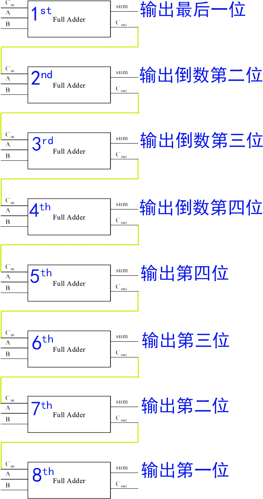

# Part 1

1. Give the three representations of an AND gate and say in your words what AND means.
 
* *Boolen Expression*: `X = A · B`  
* *Logical Diagram Symbol*:   
  
* *Truth Table*:

    | A | B | X    |
    |:--|:--|:-----|
    | 0 | 0 | 0    |
    | 1 | 0 | 0    |
    | 0 | 1 | 0    |
    | 1 | 1 | 1    |

>**AND**: Output 1 if both input values are 1.

{:start="2"}
2. Give the three representations of an XOR gate and say in your words what XOR means.

* *Boolen Expression*: `X = A ⊕ B`  
* *Logical Diagram Symbol*:   
  
* *Truth Table*:

    | A | B | X    |
    |:--|:--|:-----|
    | 0 | 0 | 0    |
    | 1 | 0 | 1    |
    | 0 | 1 | 1    |
    | 1 | 1 | 0    |

>**XOR**: Output 1 if one or the other *(but not both)* input values are 1.

{:start="3"}
3. Draw a circuit diagram corresponding to the following Boolean expression: (A + B)(B + C)

* (B+C).png)

{:start="4"}
4. Show the behavior of the following circuit with a truth table:

    | A | B | C | D | E | Output |
    |:--|:--|:--|:--|:--|:-------|
    | 0 | 0 | 0 | 0 | 0 |   0    |
    | 1 | 0 | 0 | 1 | 0 |   0    |
    | 0 | 1 | 0 | 1 | 0 |   0    |
    | 0 | 0 | 1 | 0 | 1 |   0    |
    | 1 | 1 | 0 | 1 | 1 |   1    |
    | 1 | 0 | 1 | 1 | 1 |   1    |
    | 0 | 1 | 1 | 1 | 1 |   1    |
    | 1 | 1 | 1 | 1 | 1 |   1    |

{:start="5"}
5. What is circuit equivalence? Use truth table to prove the following formula.  
**(AB)’ = A’ + B’**

* (AB)’:  

    | A | B | AB   | (AB)’ |
    |:--|:--|:-----|:------|
    | 0 | 0 | 0    | 1     |
    | 1 | 0 | 0    | 1     |
    | 0 | 1 | 0    | 1     |
    | 1 | 1 | 1    | 0     |

* A’ + B’: 

    | A | B | A’ | B’ | A’ + B’ |
    |:--|:--|:---|:---|:--------|
    | 0 | 0 | 1  | 1  |    1    |
    | 1 | 0 | 1  | 0  |    1    |
    | 0 | 1 | 1  | 0  |    1    |
    | 1 | 1 | 0  | 0  |    0    |

> The results of Truth Tables are **same**.

# Part 2

6. There are eight 1bit full adder integrated circuits. Combine them to 8bit adder circuit using the following box diagram.

7. Logical binary operations can be used to modify bit pattern.  
Such as  (X8X7X6X5X4X3X2X1)2 and (00001111)2 = (0000X4X3X2X1)2  
We called that (00001111)2 is a mask which only makes low 4 bits to work.  
Fill the follow expression

{:start="1"}
1. (X8X7X6X5X4X3X2X1)2 or (00001111)2 = 
(X8X7X6X51111)2

2. (X8X7X6X5X4X3X2X1)2
xor (00001111)2 = 
(X8X7X6X5X4’X3’X2’X1’)2

3. ( (X8X7X6X5X4X3X2X1)2 and (11110000)2 ) or ( not (X8X7X6X5X4X3X2X1)2 and (00001111)2 ) = 
(X8X7X6X5X4X3X2X1)2

# Part 3

## 概念解释

1. *Logic Gate*  
> In electronics, a **logic gate** is an idealized or physical device implementing a Boolean function; that is, it performs a logical operation on one or more binary inputs and produces a single binary output.  
>
> 在电子学中，**逻辑门**是一种被用于理想化计算布尔函数的理想化或物理的设备；它最一或者多个二进制输入进行逻辑运算并产生一个二进制输出。

2. *Boolean algebra*  
>In mathematics and mathematical logic, **Boolean algebra** is the branch of algebra in which the values of the variables are the truth values true and false, usually denoted 1 and 0 respectively.  
>
>在数学和逻辑数学中，**布尔代数**是代数的分支，其中变量的值可以是真和假，通常分别表示为1和0。

## Flip-flop

1. 中文翻译：**触发器**

2. 1 bits