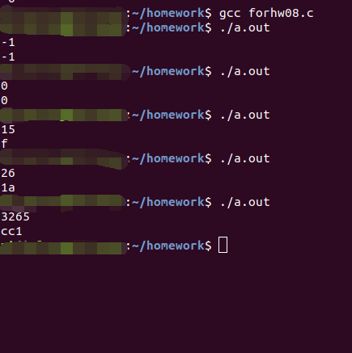

# 作业

## 1. 阅读 Pseudocode Standard。（答案可以打印）

1. 用伪代码描述将十进制转换成16进制的方法

<pre>
READ num   
IF num < 0//判断是否是负数  
    num = -num//取绝对值
    negative = 1//标记为负数
ENDIF
IF num = 0//特例
    Hex[0] = 0
ENDIF
WHILE num 不等于 0//先算出倒过来的数  
    CASE num%16  
        10 : Hex[i] = 'a'  
        11 : Hex[i] = 'b'
        12 : Hex[i] = 'c'  
        13 : Hex[i] = 'd'
        14 : Hex[i] = 'e'
        15 : Hex[i] = 'f'  
        others: Hex[i] = num % 16  
    i+=1;  
    num = num / 16  
IF negative = 1//如果负数，那么最后在输出的时候加上负号
    WRITE -//输出负号用以表示负数
ENDIF
WHILE i 不小于 0//倒序输出  
    WRITE Hex[i]  
    i-=1  
</pre>

2. C语言实现（先用注释写好算法，然后翻译）

<pre>
#include &ltstdio.h>//加载标准输入输出库
int main(){
    char Hex[10000]={0};
    int i=0,num,negative=0;
    scanf("%d",&num);//READ num
    if(num < 0){判断是否是负数
        num=-num;
        negative=1;
    }
    if(num==0){//特例
        Hex[0]='0';
    }
    while(num != 0){//倒序将每一位存入字符串
        switch(num%16){
            case 10: Hex[i]='a';break;
            case 11: Hex[i]='b';break;
            case 12: Hex[i]='c';break;
            case 13: Hex[i]='d';break;
            case 14: Hex[i]='e';break;
            case 15: Hex[i]='f';break;
            default: Hex[i]=num%16 + '0';break;
        }
        i+=1;
        num/=16;
    }
    if(negative){//负数添加负号
        printf("-");
    }
    while(i>=0){//倒序输出
        printf("%c",Hex[i]);
        i-=1;
    }
    printf("\n");
}
</pre>

3. 使用 -1, 0, 1, 15, 26，3265 最为输入测试你的程序

## 2. 名词解释与对比
1. Top-down design

> * Breaking the problem into a set of subproblems called modules  
>     将问题分割成许多个叫做模的组件
> * Creating a hierarchical structure of problems and subproblems (modules)   
>     创造一个问题的层次结构和它的子问题

2.  Work breakdown structure (WBS)

> A **work-breakdown structure** (WBS) in project management and systems engineering, is a deliverable-oriented breakdown of a project into smaller components.  
> 在项目管理和系统工程中,**工作分解结构**是将一个可分割的项目分割成更小的组件

3. 简述管理学 WBS 与 信息学 Top-down 设计的异同

> 同：都是将任务分成小部分子任务，更加便于设计和管理，准确计算时间成本和资源需求  
> 异：WBS 包括了 Top-down 设计和 Bottom-up 设计

## 3. 仔细观察您洗衣机的运作过程，运用Top-down设计方法和Pseudocode 描述洗衣机控制程序。假设洗衣机可执行的基本操作如下：

water_in_switch(open_close) // open 打开上水开关，close关闭  
water_out_switch(open_close) // open 打开排水开关，close关闭  
get_water_volume() //返回洗衣机内部水的高度  
motor_run(direction) // 电机转动。left左转，right右转，stop停  
time_counter() // 返回当前时间计数，以秒为单位  
halt(returncode) //停机，success 成功 failure 失败

1. 请使用伪代码分解“正常洗衣”程序的大步骤。包括注水、浸泡等

* 注水：  
<pre>
水位 = get_water_volume()
WHILE 水位 != 目标水位
    water_in_switch(open)
    water_out_switch(close)
    水位 = get_water_volume()
ENDWHILE
water_in_switch(close)
</pre>

{:start="2"}
2. 进一步用基本操作、控制语句（IF、FOR、WHILE等）、变量与表达式，写出每个步骤的伪代码
3. 根据你的实践，请分析“正常洗衣”与“快速洗衣”在用户目标和程序上的异同。
你认为是否存在改进（创新）空间，简单说明你的改进意见？
4. 通过步骤3），提取一些共性功能模块（函数），简化“正常洗衣”程序，使程序
变得更利于人类理解和修改维护。例如：
wait(time) //等待指定的时间；
注水(volume,timeout) //在指定时间内完成注水，否则停机；
排水(timeout)。 等子程序