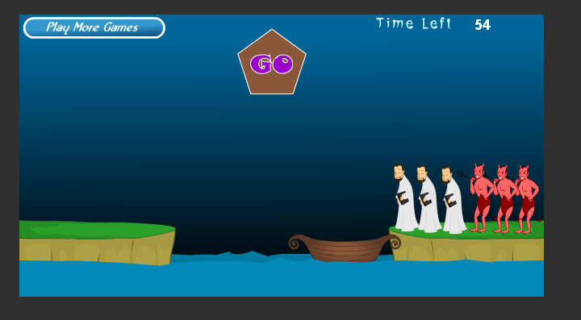
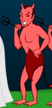

# 阅读“牧师与恶魔过河”的游戏介绍并玩游戏。然后回答问题 
1. 游戏涉及哪些类。请列表说明

> - 背景
> - 按钮
> - 船
> - 人物

{:start="2"}
2. 游戏中有哪些对象，各几个。例如，船（一个）

> - 背景：
>      - 渐变色的蓝色夜空
>      - 两块陆地
>      - 波动的海水
>      - 计分板
>      - 分数
> - 按钮：
>      - 左上角的“play more game”
>        上面的"Go"按钮
> - 船：
>      - 船
> - 人物：
>      - 牧师
>      - 恶魔

{:start="3"}
3. 类和对象的区别是什么？举一个例子说明

> 区别：*类*更像是一个对于一种东西的描述的集合，是一种**概念**，是**无形**的；*对象*则是类的一个**具体化**，它拥有所属类的全部特性，还可以拥有自己的特性，而且有着想比于类**更加实体化**的表达  
> 例子：*人物*：在岸上并且船停住的时候，人物能够在被鼠标点击时运行方法——移动并乘上小船；*牧师*：牧师拥有人物的**全部特性**，还拥有自己的具体立绘，并且在岸边牧师人数小于恶魔人数的时候被恶魔杀死。

4. 游戏中的魔鬼，有哪些属性和方法？

> 属性：
>   * 大小
>   * 颜色
>   * 形状
>   * 位置

> 方法：
>   * 在船靠岸的时候，鼠标点击该对象能使该对象上船
>   * 在船上时，如果船靠岸，鼠标点击该对象可以使该对象下船
>   * 在船上时，点击“Go”按钮能够被船移动到另一块陆地
>   * 在船不靠岸/离岸时，若魔鬼人数大于牧师人数，则杀死牧师

5. 假设魔鬼被鼠标点中，会执行onclick事件，请用文字（伪代码）描述这个事件中魔鬼与其他对象沟通的过程。

<pre>
IF 船 靠岸  THEN
    IF 魔鬼 在船上 THEN
        DO 下船1
        DO 上岸
    ELSE IF 魔鬼 在岸上 THEN
        IF 靠岸的一边 有 同类对象 THEN
            DO 上船2
        ELSE
            DO 上船1
        ENDIF
    ENDIF
ELSE
ENDIF
</pre>

6. 类或对象会是动词吗？

> 不会