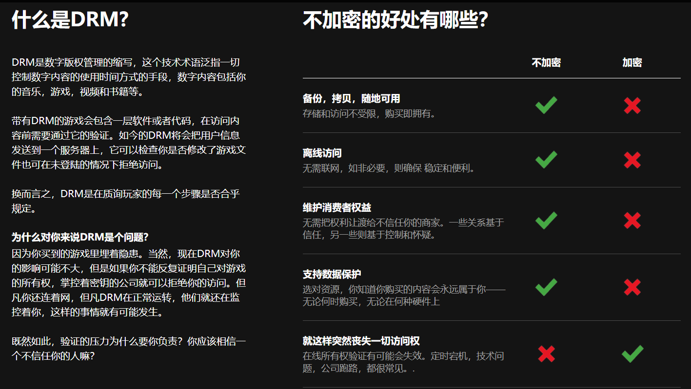
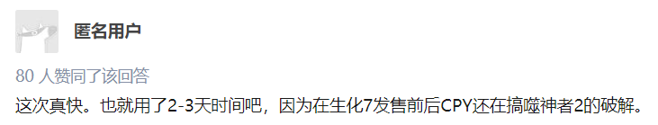

# 游戏的的DRM是否应该free

## 目录

1. <a href="#what">什么是DRM，什么是DRM-free</a>

2. <a href="#argument">争论</a>

## 1. <a name="what">什么是DRM，什么是DRM-free</a>

### 1. 什么是DRM

> 数字版权管理（英语：Digital rights management，DRM）是一系列访问控制技术，通常用于控制数字内容和设备在被销售之后的使用过程。DRM有时也称为拷贝保护、复制控制、技术保护措施等，但这些叫法存在争议。许多数字出版社和软件厂商都使用了DRM，例如亚马逊、AT&T、AOL、Apple Inc.、Netflix、Google、BBC、微软、Sony、Valve Corporation等。

——<a href="https://zh.wikipedia.org/wiki/%E6%95%B0%E5%AD%97%E7%89%88%E6%9D%83%E7%AE%A1%E7%90%86" target="_blank">维基百科（数字版权管理）</a>

*AT&T* 是美国最大的固网电话服务供应商及第一大的移动电话服务供应商,其前身是贝尔公司，这个贝尔是那位发明了电话的贝尔·格雷汉姆。

*Valve Corporation* ,即游戏界大名鼎鼎的 V 社，运营着著名数字(游戏）发行平台 steam 。

### 2. 什么是DRM-free

> DRM FREE with the no symbol removed
Label proposed by the Free Software Foundation for DRM-free works
In reaction to opposition to DRM, many publishers and artists label their works as "DRM-free".

——<a hrf="https://en.wikipedia.org/wiki/Digital_rights_management#DRM-free_works" target="_blank">Wikipedia(DRM)</a>

著名的选择 DRM-free 的公司：  
* 苹果的 iTunes 音乐商店。（**只限音乐**）  
* ComiXology，Amazon旗下的电子漫画分发商。（**给予出版商"不使用 DRM 进行分发"的选项**）  
* GOG.com (Good Old Game),CDPR 旗下的一款数字游戏发行平台。  

## 2. <a name="argument">争论</a>

### 1. 支持

1. **保护版权**：私有财产需要用锁来防止盗窃一样，知识产权也需要DRM来防止未授权使用。

——<a href="https://zh.wikipedia.org/wiki/%E6%95%B0%E5%AD%97%E7%89%88%E6%9D%83%E7%AE%A1%E7%90%86" target="_blank">维基百科（数字版权管理）</a>

2. **收入来源**：DRM可以确保可持续的收入。

<blockquote>
即使是对DRM最苛刻严厉的批评家也要承认它有它的用处。DRM也许会损害消费者的利益，但是如果没有DRM的话，公共图书馆就不能外借电子书，各个公司也无法控制他们的专有信息了。
 
　　但是你肯定不会听到DRM的批评家，甚至是DRM的倡导者表示，DRM作为唯一能够保证他们“获得一定工作回报”的唯一途径，是必不可少的。
</blockquote>

——<a href="http://www.hupress.com/index.php?m=content&c=index&a=show&catid=11&id=512" target="_blank">《DRM是唯一保证收入的方法》</a>李慧楠 

### 3. 反对

1. 

——图片来源于<a href="https://fckdrm.com/chinese.html" target="_blank">FCKDRM</a>

2. 高成本去加密，去防盗版，但是依然无法战胜**盗版**。  
（《生化危机7》D加密惨遭破解）  

<blockquote>
廠商雖然耗盡心思去設計更嚴格的 DRM 保護機制，認為這樣就可以防止盜版不會流通，但對於想要玩盜版的玩家來說，他們總是能在網路上找到破解版的載點。
</blockquote>

<blockquote>
但對於廠商來說，DRM 是他們對抗盜版的唯一武器，之前就報導過一位日本H Game的社長，屢次向盜版宣戰，但沒有一次成功。
</blockquote>

——<a href="https://www.techbang.com/posts/44871-gogcom-founder-game-drm-only-effects-and-is-a-waste-of-talent-and-time" target="_blank">Gog.com的DRM Free策略，證明了DRM唯一的作用就是浪費才能</a>

3. 某些**全程联网**要求的游戏 DRM 让玩家叫苦连连。  

（关于《神舞幻想》全程联网防盗版）
<blockquote>
2，全程联网。一款没有多人模式的游戏，全程联网只是为了反盗版，这无异于影响了玩家的权益。有些人会说，没人会专门拔掉网线，断开wifi来玩单机游戏，所以全程联网根本就不会影响玩家体验，我在想，这么说的人，是不是没上过大学？中国大部分大学，都会有晚上断网的传统，个别大学还要断电。全程联网，想要在晚上玩这个游戏，就很难了。另外，全程联网的后果，就是如果游戏更新了，你必须先更新补丁才能玩。吧里有人反应，更新补丁之后画面不如以前，但是他却没办法玩到更新补丁之前的版本，这也是全程联网的坏处。嗯，您可能是正版游戏的受害者。
</blockquote>

——<a href="https://www.zhihu.com/question/264332930/answer/284989140" target="_blank">
知乎</a> 蜡笔小奥

