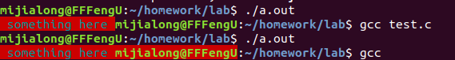
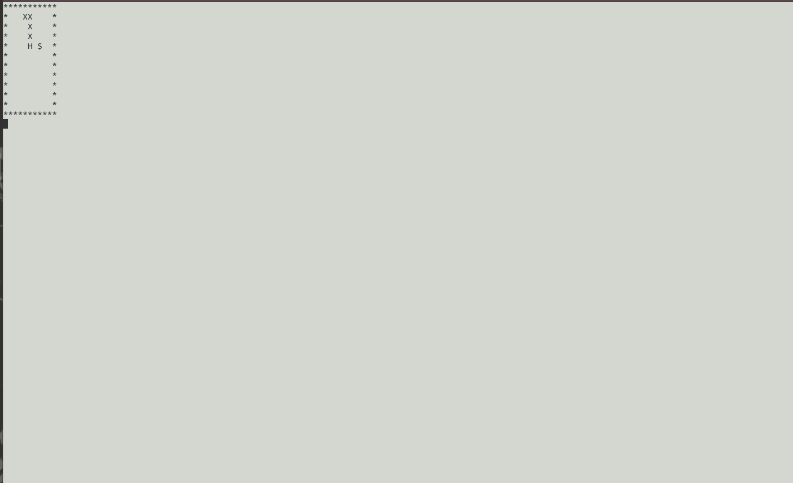
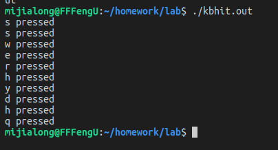

# 字符游戏——智能蛇（学习）

## 目录

1. 终端调整  
2. 非阻塞输入  
3. 智能行走

## 1. 终端调整

1. 通过官方示范：  
<pre>
    printf("\033[41;36m something here \033[0m");
</pre>
并试着将结尾处的 "\033[0m" （取消全部之前所有属性）去除，发现区别如下：  

2. 尝试将贪吃蛇的背景色换成**白色**(\033[47m)，将蛇的身体与墙壁换成**黑色**(\033[30m)，于是将 Output() 函数进行了更改，改变如下：  
<pre>
printf("\033[30;47m%s\n\033[0m);
</pre>
然而，发现其与预期效果不符（使整个终端界面变成白色底色）  

3. 修改代码，使结尾处恢复属性的代码 "\033[0m" 放到 "\n" 前，发现符合需求，于是将在胜利和失败的输出页面也加入代码，最终效果如图：  

> "\033[2J" 似乎与 "system("clear")" 命令相当，但是似乎由于 windows 系统下不支持这个命令，因此不做更改，使用兼容性更好的 "system("clear")"

## 2. 非阻塞输入

1. 阅读 kbhit() 的代码（我是直接复制的<a href="http://bbs.chinaunix.net/thread-935410-1-1.html" target="_blank">Linux下非阻塞地检测键盘输入的方法 (整理)</a>的），<del>我选择自爆</del>，将部分不需要的代码注释掉，最终的代码和网页上给的差不多（其实也就是注释掉第83行（或者左右）的else{}中的那一行）

2. 测试kbhit().c的实际性能，发现基本符合要求，效果如下：  

3. 按照网页的提示，应该将贪吃蛇代码放入 kbhit.c 文件中，但是为了避免出错/污染/冲突，选择在原本的贪吃蛇代码上进行**加载**（#include "./kbhit.c"）操作，并将 kbhit.c 中的main函数**注释**掉

4. 按照原本kbhit.c中main()函数的类似形式，将tty的代码**加入**，最终代码形式如下：  
<pre id="ks"></pre>  
*发现刷新率似乎似乎过快？*  
> 通过修改第53~54行的代码，修改刷新/输入所需要的时间（second或usecond），从而**改变自动刷新的速率**

5. 尝试使贪吃蛇变得和平常玩的贪吃蛇一样，每一步都**不再需要方向键**输入，而是向着**头的方向**进行移动，于是修改代码，让蛇只在有**方向键输入的时候改变方向**，其它时刻只需要按照**蛇头/上一次输入的方向**移动即可，代码如下：  
<pre id="ke2"></pre>  
效果基本符合需求

## 3. 智能（障）蛇

1. 根据网页给出的伪代码：
<pre>
    // Hx,Hy: 头的位置
    // Fx,Fy：食物的位置
	function whereGoNext(Hx,Hy,Fx,Fy) {
	// 用数组movable[3]={“a”,”d”,”w”,”s”} 记录可走的方向
	// 用数组distance[3]={0,0,0,0} 记录离食物的距离
	// 分别计算蛇头周边四个位置到食物的距离。H头的位置，F食物位置
	//     例如：假设输入”a” 则distance[0] = |Fx – (Hx-1)| + |Fy – Hy|
	//           如果 Hx-1，Hy 位置不是Blank，则 distance[0] = 9999
	// 选择distance中存最小距离的下标p，注意最小距离不能是9999
	// 返回 movable[p]
	}
</pre>

2. 

