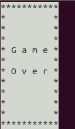

# 字符游戏——智能蛇（学习）

## 目录

1. 终端调整  
2. 非阻塞输入  
3. 智能行走

## 1. 终端调整

1. 通过官方示范：  
<pre>
    printf("\033[41;36m something here \033[0m");
</pre>
并试着将结尾处的 "\033[0m" （取消全部之前所有属性）去除，发现区别如下：  

2. 尝试将贪吃蛇的背景色换成**白色**(\033[47m)，将蛇的身体与墙壁换成**黑色**(\033[30m)，于是将 Output() 函数进行了更改，改变如下：  
<pre>
printf("\033[30;47m%s\n\033[0m);
</pre>
然而，发现其与预期效果不符（使整个终端界面变成白色底色）  

3. 修改代码，使结尾处恢复属性的代码 "\033[0m" 放到 "\n" 前，发现符合需求，于是将在胜利和失败的输出页面也加入代码，最终效果如图：  

> "\033[2J" 似乎与 "system("clear")" 命令相当，但是似乎由于 windows 系统下不支持这个命令，因此不做更改，使用兼容性更好的 "system("clear")"

## 2. 非阻塞输入

1. 阅读 kbhit() 的代码（我是直接复制的<a href="http://bbs.chinaunix.net/thread-935410-1-1.html" target="_blank">Linux下非阻塞地检测键盘输入的方法 (整理)</a>的），<del>我选择自爆</del>，将部分不需要的代码注释掉，最终的代码和网页上给的差不多（其实也就是注释掉第83行（或者左右）的else{}中的那一行）

2. 测试kbhit().c的实际性能，发现基本符合要求，效果如下：  

3. 按照网页的提示，应该将贪吃蛇代码放入 kbhit.c 文件中，但是为了避免出错/污染/冲突，选择在原本的贪吃蛇代码上进行**加载**（#include "./kbhit.c"）操作，并将 kbhit.c 中的main函数**注释**掉

4. 按照