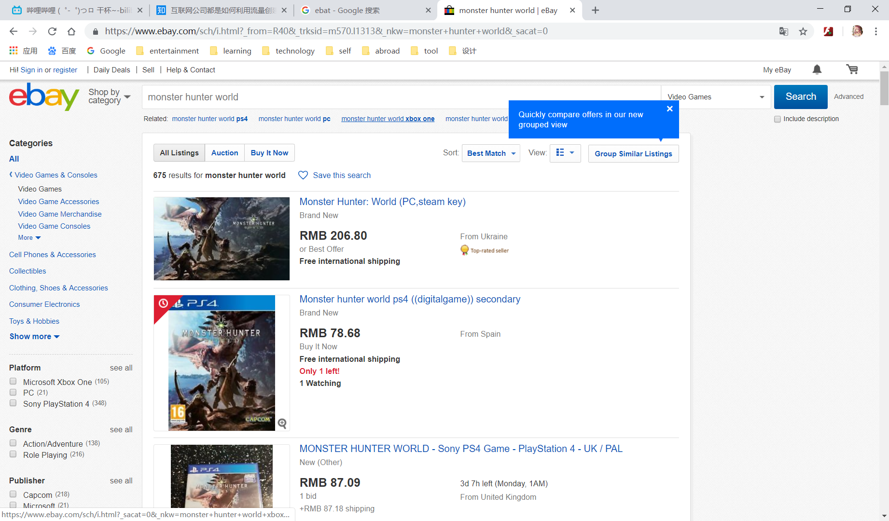

# 流量——互联网的盈利

## 目录

1. 什么是流量？流量与互联网盈利

2. 常见的互联网盈利方式

## 1. 什么是流量？流量与互联网盈利

> 吴军在浪潮之巅中，用了“**流量、流量、流量**”来强调新经济时代的核心。

如果按照**传统**的流量定义，再结合如今的现实，在笔者看来，吴军所强调的“流量”明显更加指向“单位时间内对某一事件、事物的社会关注程度”。  
例如，如今网站的“流量”，一般指的是在某个特定的时间内，不同用户进入网站并进行**浏览的总次数**；而一个视频的“流量”，则可以说是它的**播放量**......由此种种，可以发现，“流量”一词，在互联网环境下的词义在扩展，应用在泛化，在互联网的视频领域，你可以谈流量；在游戏领域，你不仅可以谈用户粘性，谈流水，更有流量可谈；在新闻领域，每一篇新闻、文章、推送的流量更是衡量其价值的核心数据——在互联网时代，**流量无处不在，流量至关重要**。

那么，互联网的盈利与流量有什么关系？

> 流量意味着体量，体量意味着分量。“目光聚集之处，金钱必将追随”，流量即金钱，流量即入口，流量的价值不必多言。

一般来说，流量大的网页一般都等价于大量的用户点击，而在庞大的用户基数下，核心用户的数量也随之提高，愿意付费的用户也多，因此作为网站收入来源之一的网站项目付费收入也就越多，B站的大会员便是一个很好的例子。  
其次，流量也意味着曝光量，曝光越足，一般而言，吸引到的客户/用户越多，其变现的能力与速度越强，现在电影上映前大量的宣传便是这个道理。

## 常见的互联网盈利模式

### 1. 广告（好的例子是google的广告系统）

1. 来源：  
平常我们浏览网页的时候，经常会在网页的各个地方看到许多<del>明显与网页内容不相关</del>的广告。这些广告的商家**付费**给网站，然后由网站将其**广告放在其网页指定位置**，于是乎，浏览网页的用户/过客便能够在浏览网页的同时接收到了广告的信息。（相当于是网站把自己的网页当作**广告摊位**来获得收入）  
当然，还有一种收费是按照**广告点击量**来进行收费的（比如google）

2. google广告系统好在哪里？  
    1. 省去了大量的成本。其成本就是**数据中心**和**带宽**以及**研发**费用。传统的传媒广告业，成本包括**运营的费用**、**批发/零售的费用**以及**订单处理**（需要人力物力），这些成本使得在（全国性）大媒体上做广告的门槛很高很高。而google呢，很大程度上省去了后两项的成本，因此这使得其在广告业的竞争力十分之强。
    2. 自动化，用户友好。google的广告系统前身是双击广告公司（DoubleClick），其通过**JS程序**，将广告**投放过程自动**，与传统广告的还需商讨规划使用哪些网页的哪些位置的**半手工操作**来说，方便多了。而google在收购了DoubleClick之后，打造了一个**自动接纳广告**的系统，还有自动模拟效果的系统，十分**用户友好**
    3. 匹配。google的搜索算法十分强大，能够从网页内容中提取**关键词**，从而保证广告内容和网页内容**相关**，因此便于吸引流量。

### 2. 在线市场（电子商务）

1. 来源：  
就是**平台交易的手续费**。这个手续费可以包含广告的，也可以是其他如销售分成与挂牌费。  
这个在我们生活中比较常见，比如说**淘宝+支付宝**，**京东**，**亚马逊**以及**eBay**，这些购物平台，或者说电商平台紧紧围绕在我们身边，成为了我们生活的重要组成部分。现在谁没用过这些购物平台买东西呢？  

2. 好处：  
    1. 方便。这点自不必说，足不出户便可以购买天下之物，这极大的冲击了传统的销售。
    2. 成本损失少。传统的销售需要经过重重的中间商逐级从生产商到买家手中，而电商的诞生使得生厂商与顾客之间只需要经过电商平台这一个中间人，使得差价成本大大降低。

3. 缺点：  
    信用问题。这是销售领域一直都由的问题，而电商领域这里尤为严重——买家与卖家的间隔被拉大，买家与商品的距离更大了，商品与实物不符，收货不付款、收款不发货这些情况越发严重。说到底，这是由于电商平台的本质——人与人、人与物的**无法面对面**导致的。