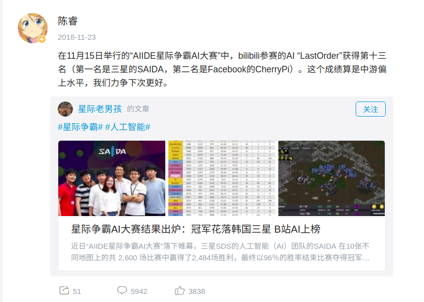
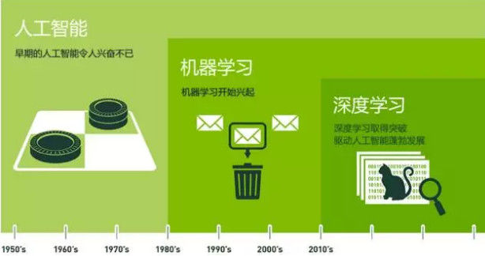
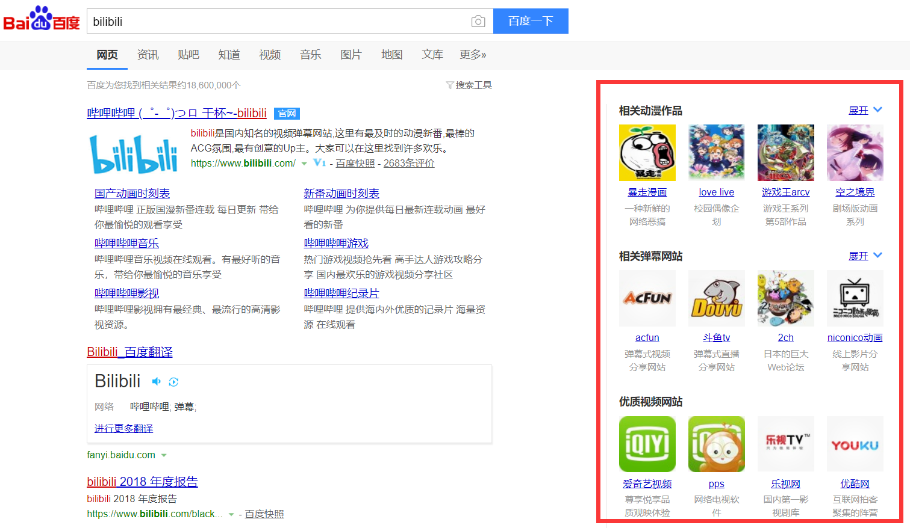
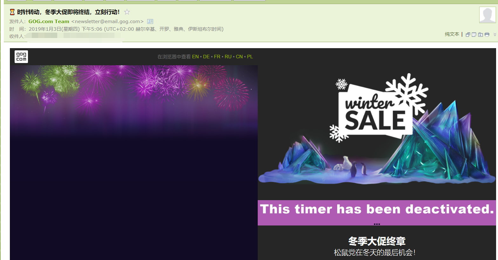

# 互联网的热点领域与营销方法

## 目录

1. 互联网热点领域  
    * <a href="#ai">人工智能</a>
    * <a href="#bd">大数据</a>
    * <a href="#cc">云计算</a>
    * <a href="#ml">机器学习与深度学习</a>

2. <a href="#sell">互联网常见营销方法</a>

## 1. 互联网热点领域

### 1. 人工智能

人工智能，顾名思义，是人工创造的机器所表现出来的智能，也是我们常说的 AI（**A**rtificial **I**ntelligence）。  
最近几年，人工智能越来越火，人才需求缺口大，据领英2017年发布的《全球AI领域人才报告》显示，截至2017年一季度，基于领英平台的全球AI（人工智能）领域技术人才数量超过190万，仅国内人工智能人才缺口达到500多万。  
而基于人工智能所衍生出来的大量相关产业/领域也逐渐变成人们口中常驻话题：  
* 无人驾驶：用 AI 代替司机来进行驾驶，既可以省去“司机”这一**人力资源**，还可以通过其进行**路况分析**并进行**调节路况**。无人驾驶的 AI 需要训练其根据环境控制车速，根据外部信息调整路线等方面的能力。因此，无人驾驶领域的影响力在逐步放大，然而，科技的发展总不是一帆风顺的，更何况无人驾驶现在的开发程度是否能够进行实用还是一个争论的话题：2018年3月的一起无人驾驶车事故，给无人驾驶的发展蒙上了一层阴影，同年5月，无人驾驶的领头羊 Uber 关闭了其在美国亚利桑那州的无人驾驶业务。  
  
* 数据伦理：这是大数据与人工智能融合后出现的一个道德问题。通过大数据领域相关技术的获取用户的数据，通过人工智能对其分析后，在根据分析结果利用用户的喜好渗透进入社交网络，从而进一步改变用户行为模式，由此形成一个完整的闭环。然而**数据泄密**导致的这些数据的**不恰当利用**，如2018年爆出的2016年美总统大选期间， Facebook 泄露的5000万用户数据应用到了政治广告的投放上，以及2018年年末12306的大规模用户个人信息泄露问题，既导致了用户对于应用、网站的不信任，还引发了社会对于对“数据伦理”的思考。  
  
* 机器是否会代替人：人工智能的出现以及不断完善使得其在特定领域展现出了**强大的性能**，人们开始怀疑自己会不会被 AI 代替，最终出现 **AI 淘汰人类**的情况。而 Alpha Go 的出现与强势更加加深了人们的恐惧，关于这个话题的争论没有停歇过，而第一个拥有国籍的 AI 索菲亚的出现更是引起了轩然大波，即使现在主流的观点是机器无法代替人类的创造作用，但是**恐怖谷效应**还是需要我们在日常生活与开发过程中注意的。（  

（吐个槽，就连B站都在开发自己的**视频审核人工智能**，而他们的星际争霸对战 AI 甚至在相关比赛中取得了13名的成绩  

### 2. 大数据

> 大数据（英语：Big data），又称为巨量资料，指的是传统数据处理应用软件不足以处理它们的**大或复杂的数据集**的术语。大数据也可以定义为来自**各种来源的大量非结构化或结构化数据**。从学术角度而言，大数据的出现促成了广泛主题的新颖研究。这也导致了各种大数据统计方法的发展。大数据并没有抽样;它只是观察和追踪发生的事情。因此，大数据通常包含的数据大小超出了传统软件在可接受的时间内处理的能力。由于近期的技术进步，发布新数据的便捷性以及全球大多数政府对高透明度的要求，大数据分析在现代研究中越来越突出。  

——Wikipedia

相比于人工智能，大数据离我们的生活近得多，你所看的几乎每一则广告都有大数据技术在背后推波助澜。  大数据的应用在如今非常广泛，现在大量的公司的创业、调研、开发/创新都离不开大数据。一般里说，大数据有如下作用：  
* 了解用户喜好-->渗透社交网络-->改变用户行为。举个通俗的例子就是，你早上在百度搜索“高达”，下午你打开淘宝或者京东的时候就会受到相关的推荐了。听起来到的确是有点恐怖，因此关于用户数据利用的“**数据伦理**”相关问题逐渐引起了社会关注与反思。  
* 分析未来形式。用过大数据分析，可以比较清楚的了解到某一个事件/事物的**发展趋势**，从而进行投资、建议以及分析等操作。而国家的宏观经济调控，也绝对少不了大数据的帮助。  

### 3. 云计算

随着 Google 宣布与 Ubisoft （即育碧）合作，宣布在 Chrome 浏览器内，用户可以玩到《刺客信条：奥德赛》，玩家们发现自己可以真的变成“云”玩家，是玩游戏的那种。这个“云”，与云计算中的“云”同义，都是网络、互联网的一种比喻说法。而狭义的云计算，就是原本需要在自己电脑上进行的计算与分析，用户可以将数据发给远方的服务器群，交给它们来进行操作与计算，最终将结果发回给用户的一种做法。各国的**超级计算机**的使用也不外乎是，高校、企业、政府通过其进行云计算。  
从广义上来说，云计算（英语：cloud computing），是一种**基于互联网**的计算方式，通过这种方式，共享的**软硬件资源和信息**可以按需求提供给计算机各种终端和其他设备。云计算描述了一种基于互联网的新的 IT 服务增加、使用和交付模式，通常涉及通过互联网来提供**动态易扩展而且经常是虚拟化的资源**。  
  
著名的 IBM 公司在逐步放弃自己软硬件的发展方式的同时，以其出色的**云服务**稳固了自己的商业地位，其影响的领域也还在不停扩大。可以预言，在不久的将来，随着5G的普及与带宽的飞速扩张，即使个人电脑的性能在不断上升，但更加吃资源与配置的计算依然是个人/企业/科研机构/政府的难题，因此，云计算产业将会持续蓬勃的发展，并且，个人便携终端的存在（便携但是配置低）

### 4. 机器学习与深度学习

机器学习：一种实现人工智能的方法  
深度学习：一种实现机器学习的技术  

机器学习**最基本**的做法，是使用**算法**来解析数据、从中学习，然后对真实世界中的事件做出决策和预测。与传统的为解决特定任务、硬编码的软件程序不同，机器学习是用大量的数据来“训练”，通过各种算法从数据中学习如何完成任务。  
深度学习本来并不是一种独立的学习方法，其本身也会用到有监督和无监督的学习方法来训练深度神经网络。但由于近几年该领域发展迅猛，一些特有的学习手段相继被提出（如**残差网络**），因此越来越多的人将其单独看作一种学习的方法。  
传统的机器学习算法在指纹识别、基于Haar的人脸检测、基于HoG特征的物体检测等领域的应用基本达到了商业化的要求或者特定场景的商业化水平，但每前进一步都异常艰难，直到深度学习算法的出现。深度学习摧枯拉朽般地实现了各种任务，使得似乎所有的机器辅助功能都变为可能。无人驾驶汽车，预防性医疗保健，甚至是更好的电影推荐，都近在眼前，或者即将实现。

但是，深度学习还存在以下特点：
1. 需要大量的数据训练。
2. 太过复杂，对付小问题时杀鸡用牛刀。
3. 深度学习并不是对人脑的模拟

## 2. 互联网的营销方法

如今，随着社交方式越来越多，互联网上的营销方法也越来越多，但大体上概括来说，常见的有如下几种营销方法：

1. 基于搜索的推广：  
利用**搜索引擎**、**分类目录**等具有**在线检索信息**功能的网络工具进行网站推广。由于搜索引擎的基本形式可以分为网络蜘蛛型搜索引擎（简称搜索引擎）和基于人工分类目录的搜索引擎（简称分类目录），因此搜索引擎推广的形式也相应地有基于搜索引擎的方法和基于分类目录的方法。  
当我们打开浏览器，使用搜索引擎进行搜索的时候，经常能在搜索之后看到与搜索相关的广告/推广，这就是基于搜索的推广。  
  
2. 电子邮件营销：  
是在基于**用户许可**的情况下，以订阅的方式将行业及产品信息通过**电子邮件**的方式提供给所需要的用户，以此建立与用户之间的信任与信赖关系。  
许多网站的账号注册页面会有一个勾选项，内容类似为“**订阅邮件**来获取最新的信息”。  
  
3. 微博微信平台营销：  
日常生活中接触几乎最多的营销方式之一。有点是其用户**广泛**，使用**频繁**，贴近日常，并且营销**成本低廉**，一般来说只需要一个人和一个账号即可解决。而缺点则是容易走极端，要么被疯狂传播，要么被无限屏蔽，成功案例比较少，是一种不甚成熟的营销方法。  
4. 视频营销：  
基于抖音、快手、B站等视频网站的大量用户，使得基于视频的营销/推广变得十分容易。视频制作者通过制作自己视频的同时插入部分软广达到宣传的目的的同时获得报酬，“毕竟人也是要恰饭的嘛”，比如说某著名靠爱发电的UP主蕾丝（笑。也可以在播放视频的时强制展示广告，从而达到目的，和电视广告相当，重复性高，但是成本高，精准度低，有些时候还挺烦的。  
