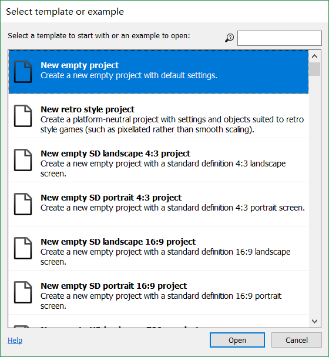
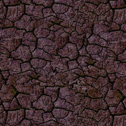

# 完成Beginner's guide to Construt 2

目录
* <a href="#c1">安装Construct 2</a>

* <a href="#c2">新建项目</a>

* <a href="#c3">导入素材（背景，对象等）</a>

* <a href="#c4">行为、事件及</a><!--大体完成 -->

* <a href="#c5">其他优化</a>

* <a href="#c6">实例演示</a>

## <a name="c1">安装Construct 2</a>

1. 下载：进入<a href="https://www.scirra.com/construct2" target="_blank">Construct 2官网</a>，点击`download`（Construct2并不需要购买，免费版本就够用了）并等待下载结束即可。

2. 安装：除了安装位置，都可以无脑`下一步`。

## <a name="c2">新建项目</a>

1. 打开Construct 2,点击左上角蓝色的`file`，选择`open`打开一个新的空白项目（*empty project*）。

2. 建立空白项目之后有一些方便制作游戏的小技巧：
>1. `ctrl+鼠标滚轮`可以在*layout1*进行放缩操作（不会影响其大小）。
>2. 按住`space`（空格）再`移动鼠标`可以“抓住”当前位置进行移动。
>3. 如果不小心关掉*Properties Bar*或*Layers Bar*或*Objects Bar*，可以点开`file`旁边的`view`，勾选*Properties Bar*、*Layers Bar*、*Object Bar*即可再次打开（如下图）。
>

{:start="3"}
3. 在*Properties Bar*中调整*layout Size*（整个地图的大小）的大小为**1280*1024**，*Margins*（镜头的大小）调整为**500*500**（如下图）。  

## <a name="c3">导入素材（背景、对象等）</a>

1. 导入背景：鼠标`双击`中间的白色区域（或者`右键`-->`Insert new object`），弹出窗口后在*General*选项中双击`Tiled Background`。  

在光标变成十字之后点击白色区域任意一部分，打开Edit界面，点击上栏左数第二个按钮，选择将**bg.png**导入后关闭Edit界面。并通过图片周围的小白点将*layers1*用背景覆盖。  

>对于背景：为了避免在调试其他对象的时候**误选**背景，笔者推荐在*Layers Bar*的**Layer栏**中将*Layer0*`右键`-->`Rename`为*background*（或者其他便于记忆的层名），并且将该层**锁定**。
>
>
>
>背景图（右键另存为即可下载）：  
>

2. 导入玩家、怪物、子弹、爆炸：
在导入这些素材之前，先新建一个层，用*Main*命名表示它是我们游戏主要的展示层。  
打开*Insert New Object*界面，选择`Sprite`（精灵），像**导入背景**一样导入*Player*（玩家）、*Bullet*（子弹）、*Monster*（怪物）、*explode*（爆炸）。并分别将这些素材改**成对应的名字**。

>素材（右键另存为即可下载）：
>
>
>
>
>

>关于*sprite*：
>
>1. 该点可调整角色朝向。
>2. 点击，在*image point*中新添加一个点，设置为*shoot*，后面会将其设置为子弹射出的**初始位置**（这样会使动画效果看上去更加真实）。
>

## <a name="c4">添加行为、事件及动作</a>

>在添加上述之前，我们注意到，该游戏是需要对*Player*进行操控的，那么，就需要双击层，在*input*项选择并添加**Mouse**和**Keyboard**，这样我们就可以在后续游戏成品中通过鼠标和键盘的输入控制*Player*了

### 添加行为：
1. 选中对象，在*Properties Bar*的*Behaviors*栏中找到蓝色字体的`Behaviors`，点开。  

2. 点击`加号`，在弹出的窗口，我们能见到许多不认识的行为，没有关系，我们只需要其中的几个行为就好：  
* *Bullet*:**Bullet**（像子弹一样（匀速）运动）, **DestroyOutsideLayout**（当离开整个层的时候自我毁灭）
* *Player*: **8 Direction**（可通过*arrow keys*（方向键）进行八向移动）, **ScrollTo**（界面随人物移动而滚动——保持人物在屏幕内）, **BoundToLayout**（使人物不会移动到层外面去）  
* *Explode*: **Fade**（淡入淡出）
>1. 在*Properties Bar*将*Fade out ti*（淡出时间）改成0.5（使动画效果更加顺畅）  
>2. 在*Properties Bar*中的*Effect*将**blend mode**改成`additive`，这样会使运行过程中图片的黑底消失（动画效果不那么违和）

* *Monster*: **Bullet**

>如果你想多添加一下怪物的话，那么你可以对怪物按住`ctrl+鼠标左键`再`拖动`即可获得**同类**（*当你修改其中一个对象的时候，同类的其他对象也会改变*）的对象。

>调整速度：即使有了*子弹*行为，怪物与子弹的速度也需要调整
>
>在*Behaviors*栏将*Speed*修改：**子弹**为400；**怪物**为80

### 添加事件及动作

1. 点开*Event Sheet*（事件簿），发现是一片空白。  

2. 我们需要先添加**Event**（事件）来给我们预想中的一系列反应加上行动**条件**，比如说：  
* 如果我们需要让**人物的一直朝向鼠标方向**，就需要如下图的事件动作  

* 如果我们需要让人物在**每一次我们按鼠标左键**时`射出子弹`，命令如下：  

* 如果我们需要让子弹碰到的怪物“死亡”，那么就可以在**子弹碰到怪物的时候**（条件）-->`产生爆炸+子弹和怪物一起消失`，具体命令如下。  

* **怪物碰到人物**-->`人物死亡+爆炸`，同理。  

这时候，我们的游戏就可以开始运行游玩了。

## <a name="c5">其他优化</a>

1. 不能**使用键盘WASD进行移动**？  
>对于许多小伙伴来说，方向键并不是常用的移动键，这时候就需要将WASD加入输入了，具体命令如下：  
>

2. 只有一波怪物怎么办？  
>按照我们前面的设置，怪物只有一波，打完了就没了，那么我们就需要**不断地产生新的怪物**，具体命令如下： 
>  
其中怪物的刷新地点可以自由调整（你刷人物脸上也没事）。

3. 怪物只会按照我摆设的角度前进怎么办？  
>1. 在**开始的时候**，我们可以给怪物的前进方向`添加一个随机的角度`，命令如下：  
>
>
>2. 在**怪物离开层的时候**，让怪物`朝向人物的方向`前进，命令如下：  
>
>
>3. 在**怪物靠近人物**的时候，`转向人物所在的方向`，命令如下：  
>  
>注意：在选择判断距离时，选择`Compare two values`（比较两个值）

## <a name="c6">实例演示</a>

