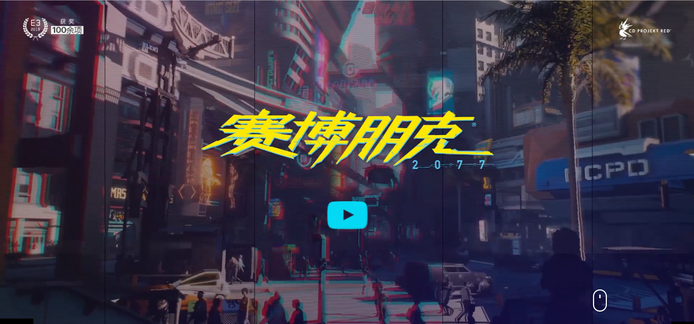

# 公司介绍：波兰蠢驴——CD Project

>前言：在一个多月前的E3展上，随着一段惊艳的玩法演示，《赛博朋克2077》再次引发了热潮，精良的画面，多元的选择，让人们不得不抚摸着自己的良心，再次大声赞美“波兰蠢驴”。那么，就让我们看看这位波兰游戏界的顶梁柱之一，世界游戏界的一股清流，传说中的波兰蠢驴——`CD Project（Red）`。

>PS:《赛博朋克2077》的官方玩法演示请戳B站链接：<a href="https://www.bilibili.com/video/av30495570" target="_blank">《赛博朋克2077》官方2018版玩法演示中文语音版</a>（波兰蠢驴天下第一！（破音））
>
>PS:波兰游戏界的另一个顶梁柱是11 bit studio，他们的代表作有*This War of Mine*（中文译名《这是我的战争》）、*Beholder*（中文译名《监视者》）。

## 目录

1. <a href="#c1">公司概述</a>

2. <a href="#c2">诞生经历</a>

3. <a href="#c3">重要作品</a>

4. <a href="#c4">“清流”之意</a>

5. <a href="#c5">近日事件</a>

## <a href="c1">公司概述</a>

* 创立时间：1994

* 创立人物：马尔钦·伊温斯基（Marcin Iwiński）、
米卡·季辛斯基（Michał Kiciński）

* 总部位置：波兰华沙（没错，就是《华沙条约》的那个华沙）

* 业务范围：游戏开发、发行、销售

* 代表产品：《巫师3：狂猎》、《赛博朋克2077》（未发售）、GOG.com平台

## <a name="c2">诞生经历</a>

1. 盗版出身：由于两极分化,美苏冷战，在苏联控制下的波兰很难玩到西方游戏，于是公司创始人之一的**马尔钦·伊温斯基**在中学时期就开始售卖*破解版*（也就是我们常说的*盗版*）游戏。

2. 转行正版：在马尔钦遇到了他的贸易伙伴兼后来CD Project联合创始人——**米卡·季辛斯基**后，他们逐渐想要合法开展业务，并率先从美国零销商进口*CD-ROM游戏*（即*光盘游戏*）。

3. 良心初现：在成立公司之后，CD Project积极引进外国游戏，并进行本地化。一个著名的例子就是著名RPG<a href="https://zh.wikipedia.org/wiki/%E5%8D%9A%E5%BE%B7%E4%B9%8B%E9%97%A8" target="_blank">*博德之门*</a>的本地化——他们不仅**将文本从英文翻译成波兰文**，还**邀请知名演员为游戏配音**，并在在游戏包装中**追加精美赠品**，而在当时，没有一家零售商能够将原版英文翻译成波兰文。

3. 艰难开发：在对分销的热情退却后，两位创始者将自己的目光对准了游戏开发上来，他们购买了著名小说——**安德烈·斯帕克沃斯基（Andrzej Sapkowski）**的《猎魔人》，并且成立了现在广为人知的CD Project RED（后简称`CDPR`）。但是没有任何开发经验的经历了一系列失败之后，终于在耗时五年的研发以及B社**Bioware**的大力支持下，拿出了一个收获了积极评价的*The Witcher*（中文译名《巫师》）。但是由于主机版本项目的取消以及经融危机的到来，公司濒临破产。

4. 扬名启航：遭遇了重大打击，为了维持公司的持续，CDPR开始专心打造用于《巫师》后作的引擎`REDengine`，并且在经历了三年半的研发之后，*The Witcher 2:Assassins of Kings*（中文译名《巫师2：国王刺客》）于2011年发售，同时收获了大量好评和销量（170万份）。

5. 名声大噪：《巫师2》的成功带给CDPR的各位更大的动力，他们想要给《巫师》的下一作一个自由的开放世界，想要画质更加精良，内容更加丰富。于是，又是同样的三年半，*The Witcher 3:Wild Hunt*（中文译名《巫师3：狂猎》）发售了。凭借着丰富的游戏内容，优秀的画面，引人深思的任务选择，大量的免费拓展包等诸多令玩家大呼“良心”的特点，《巫师3》名副其实地拿到了2015年的**年度最佳RPG**奖，并且，又随着大型拓展包《血与酒》的发售，该游戏又荣获2016年的**年度最佳RPG**奖。这也让CDP(R)“波兰蠢驴”的帽子坐实了。（笔者：一个RPG连续两年获得年度最佳也是没谁了）

## <a name="#3">重要作品</a>

1. *<a href="https://thewitcher.com/en/witcher3/" target="_blank">The Witcher 3:Wild Hunt</a>*《巫师3：狂猎》

2. *<a href="https://www.cyberpunk.net/zh-cn/" target="_blank">CyberPunk 2077</a>*《赛博朋克2077》（未发售）

## <a name="c4">“清流”之意</a>

为什么称蠢驴是游戏界的一股清流呢？

>因为他们太良心了！
>
>1. **反对<a href="https://en.wikipedia.org/wiki/Digital_rights_management" target="_blank">DRM加密</a>**。盗版泛滥的而今天，各个厂商都无所不用其极地对自己的游戏进行DRM加密，以此来维护自己的利益。但是CDPR反对DRM加密，并且身先士卒地免DRM加密售卖自己《巫师》系列，不仅如此，旗下的GOG平台售卖的游戏更是同样*DRM-Free*（即免DRM加密）。他们认为DRM加密不能有效阻止软件盗版，还会陷入破解——升级加密——破解的死循环。事实上，他们的方法不仅是缺钱想玩的玩家们合法地玩上《巫师》系列，还成功地名利双收。
>
>2. **认为*DLC*（可下载内容，Downloadable Content，简称DLC，又称追加下载内容）免费**。他们认为DLC免费应该成为行业标准，并且“制作一个一个DLC其实并不需要太多的资源”，而《巫师3：狂猎》中的15个免费DLC便是最好的例证。（笔者：没错，说的就是你，EA）
>
>
>3. **用心做游戏，用脚卖游戏**。这当然是一句玩笑话。《巫师3：狂猎》中唯二收费的剧情拓展包《石之心》与《血与酒》内容十分丰富，剧情长度堪比游戏本体，尤其是《血与酒》被玩家们戏称为《巫师4》，“波兰蠢驴把《巫师4》当作DLC卖”也是玩家们的一句赞美。而且，在steam与他们自己的GOG平台上，《巫师》系列动不动就50%off，这怎么不吸引玩家们入正（剁手）呢。

## <a name="c5">近日事件</a>

近日，*The Witcher*小说（中文译名《猎魔人》）的作知**安德烈·斯帕克沃斯基（Andrzej Sapkowski）**的律师函，律师函中作者声称自己对CDPR的关于*The Witcher*的授权只限于《巫师》第一部，后续游戏皆造成了侵权，因此律师函要求CDPR支付将近1600万美元的版税。对此，CDPR坚定地说了：NO！

机核网关于此事件的报道<a href="https://www.g-cores.com/articles/102615" target="_blank">请戳我</a>。

>本文部分资料来源于<a href="https://zh.wikipedia.org/wiki/CD_Projekt" target="_blank">Wikipedia的CD Project页面</a>
>
>图片由笔者截自网络