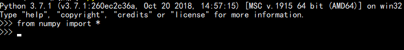
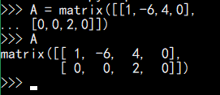
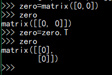

# 使用 Python 求解

## 目录

1. 使用 Python 求解高等数学

2. 使用 Python 求解线性代数

## 高等数学

## 线性代数

### 1. What is the dimension of the subspcae spanned by the given vector.

$$ \vec{a} $$ 

A = $ \begin{bmatrix} 1 & -6 & 4 & 0 \\ 0 & 0 & 2 & 0 \\ \end{bmatrix} $

> 思路：求零空间，本质上是求 $$ A \vec{a} = \vec{0} $$的解

1. 加载库  

2. 创建题目给的矩阵  

3. 创建**零向量**

4. 使用linalg.solve()函数求解
