# 使用 Python 求解

## 目录

1. <a href="#math">使用 Python 求解高等数学</a>

2. <a href="#linalg">使用 Python 求解线性代数</a>

## <a name="math">使用 Python 求解高等数学</a>

### 1. 求 $ (x^{3} \dot \cos x)^{(10)} $

1. 加载库  
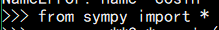

2. 创建变量 x  
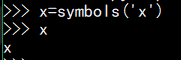

3. 创建表达式  
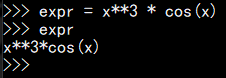

4. 求该式的导数  
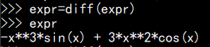

5. 多次求导  
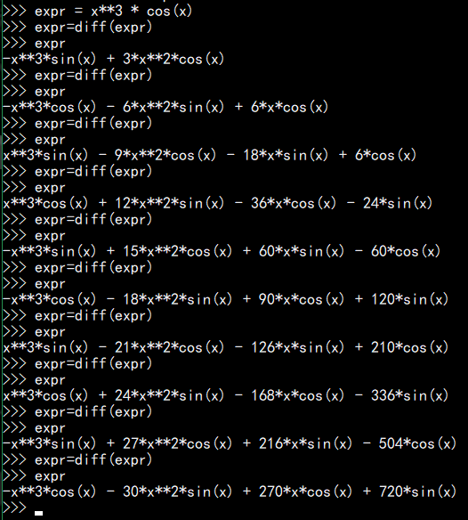

### 2. 求上述函数在区间[0,1]的积分

1. 使用函数 integrate() 进行积分  
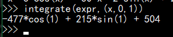

## <a name="linalg">使用 python 求解线性代数</a>

### 1. What is the RANK of the given vectors

$$ \vec{a} = \begin{bmatrix} 1 \\ -3 \\  2 \\ -4 \\ \end{bmatrix} $$
$$ \vec{b} = \begin{bmatrix} -3 \\ 9 \\ -6 \\ 12 \\ \end{bmatrix} $$
$$ \vec{c} = \begin{bmatrix} 2 \\ -1 \\ 4 \\ 2 \\ \end{bmatrix} $$
$$ \vec{d} = \begin{bmatrix} -4 \\ 5 \\ -3 \\ 7 \\ \end{bmatrix} $$

1. 加载库  
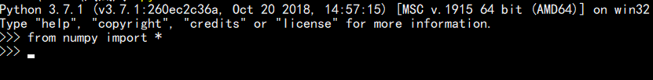

2. 创建题目给的矩阵  
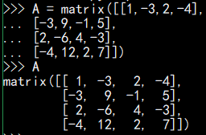

3. 使用.shape查看矩阵维度  
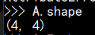

### 2. 求下列矩阵的转置、逆（如果可逆）

B = $$ \begin{bmatrix} 0 & 1 & 2 \\ 1 & 0 & 3 \\ 4 & -3 & 8 \\ \end{bmatrix} $$

1. 输入上述矩阵  
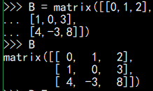

2. 求解上述矩阵的转置  
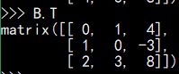

3. 求上述矩阵的逆  
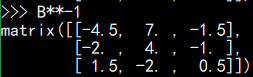

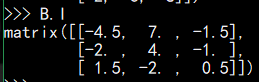

## 小结

> Python 的科学计算功能十分强大，令人羡慕；函数众多，需要阅读文档或者查找资料之后才方便找到所需要的函数；功能强大但是也比较复杂，需要对相关的数学知识有比较好的了解，否则可能各种报错却找不到bug。