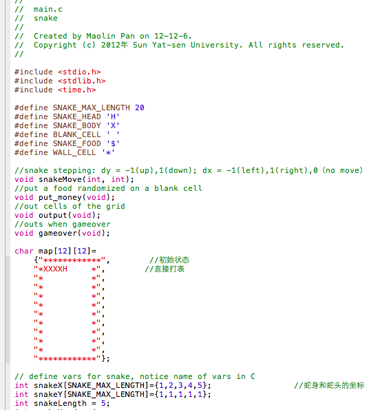

# 贪吃蛇实验报告
##  18342078
---
### 目录
- 一、实验目标
- 二、实验环境
- 三、实验步骤与结果
---
### 一、实验目的
1. 了解字符游戏的表示
2. 体验**自顶向下**的设计方法实现问题求解
3. 使用伪代码表示算法
4. 使用函数抽象过程

### 二、游戏要求与表示
给定一个10*10的字符矩阵表示蛇的生存空间,其中有一条长度5的蛇(HXXXX), “H”表示蛇头,“X”表示蛇身体。空间中可能有食物（“$”表示）和障碍物（“*”表示）。

你可以使用“ADWS”按键分别控制蛇的前进方向“左右上下”, 当蛇头碰到自己的身体或走出边界,游戏结束,否则蛇按你指定方向前进一步。

### 三、编程要求
#### 1、任务1：会动的蛇
* 程序头部要求

* 伪代码
```
	输出字符矩阵
	WHILE not 游戏结束 DO
		ch＝等待输入
		CASE ch DO
		‘A’:左前进一步，break 
		‘D’:右前进一步，break    
		‘W’:上前进一步，break    
		‘S’:下前进一步，break    
		END CASE
		输出字符矩阵
	END WHILE
	输出 Game Over!!! 
```
* C语言代码
```
#include <stdio.h>
#include <stdlib.h>
#include <time.h>

#define SNAKE_MAX_LENGTH 20
#define SNAKE_HEAD 'H'
#define SNAKE_BODY 'X'
#define BLANK_CELL ' '
#define SNAKE_FOOD '$'
#define WALL_CELL '*'

char map[13][13]=
{"************",//初始状态 
 "*XXXXH     *",//直接打表 
 "*          *",
 "*          *",
 "*          *",
 "*          *",
 "*          *",
 "*          *",
 "*          *",
 "*          *",
 "*          *",
 "************",
};

//define vars for snake, notice name of vars in C
//int snakeX[SNAKE_MAX_LENGTH] = {1,2,3,4,5};
//int snakeY[SNAKE_MAX_LENGTH] = {1,1,1,1,1};
int snakeLength = 5;
int snake_xy[SNAKE_MAX_LENGTH][2];//x横坐标，y纵坐标
int end = 0;

void output(){
	system("cls");//win清理控制台 
	for(int i = 0; i < 12; ++i){
		printf("%s\n", &map[i]);
	}
}

//snake stepping: dy = -1(up),1(down); dx = -1(left),1(right), 0 (no move)
void moveButHead(int snakeLength){
	map[snake_xy[snakeLength-1][0]][snake_xy[snakeLength-1][1]] = ' ';//蛇尾变为' ' 
	for(int i = snakeLength-1; i > 0; --i){//后一节替代前一节的位置
		snake_xy[i][1] = snake_xy[i-1][1];//倒叙赋值，从尾部开始拷贝，防止覆盖原数据 
		snake_xy[i][0] = snake_xy[i-1][0];
	}
}

void endGame(){
	system("cls");
	printf("GAME OVER");
}

void snakeMove(int snakeLength){
	char instructer = getchar();
	switch(instructer){
		case 'a': case 'A':{ 
			if(snake_xy[0][0] != snake_xy[1][0]){//蛇头和第二节不在同一行 
				moveButHead(snakeLength); 
				map[snake_xy[0][0]][snake_xy[0][1]] = 'X';//原蛇头变为蛇身 
			    map[snake_xy[0][0]][snake_xy[0][1]-1] = 'H';//蛇头向左转
		    	snake_xy[0][1]--;//蛇头纵坐标-1 
			} 
		} break;
		case 'd': case 'D':{ 
			if(snake_xy[0][0] != snake_xy[1][0]){//蛇头和第二节不在同一行 
				moveButHead(snakeLength); 
				map[snake_xy[0][0]][snake_xy[0][1]] = 'X';//原蛇头变为蛇身 
			    map[snake_xy[0][0]][snake_xy[0][1]+1] = 'H';//蛇头向右转
		    	snake_xy[0][1]++;//蛇头纵坐标+1 
			} 
		} break;
		case 'w': case 'W':{ 
			if(snake_xy[0][1] != snake_xy[1][1]){//蛇头和第二节不在同一列 
				moveButHead(snakeLength); 
				map[snake_xy[0][0]][snake_xy[0][1]] = 'X';//原蛇头变为蛇身 
			    map[snake_xy[0][0]-1][snake_xy[0][1]] = 'H';//蛇头向上转
		    	snake_xy[0][0]--;//蛇头横坐标-1 
			} 
		} break;
		case 's': case 'S':{ 
			if(snake_xy[0][1] != snake_xy[1][1]){//蛇头和第二节不在同一列 
				moveButHead(snakeLength); 
				map[snake_xy[0][0]][snake_xy[0][1]] = 'X';//原蛇头变为蛇身 
			    map[snake_xy[0][0]+1][snake_xy[0][1]] = 'H';//蛇头向下转
		    	snake_xy[0][0]++;//蛇头横坐标+1 
			} 
		} break;
		case 'q': case 'Q':{
			end = 1;
			endGame();
		}break;
	}
}

int main(){
	//初始化位置作标 
	for(int i = 0; i < snakeLength; ++i){
		snake_xy[i][0] = 1;//初始位置在第二行
		snake_xy[i][1] = snakeLength - i; 
	}
	while(end != 1){
		output();
		snakeMove(snakeLength);
	} 
}
```